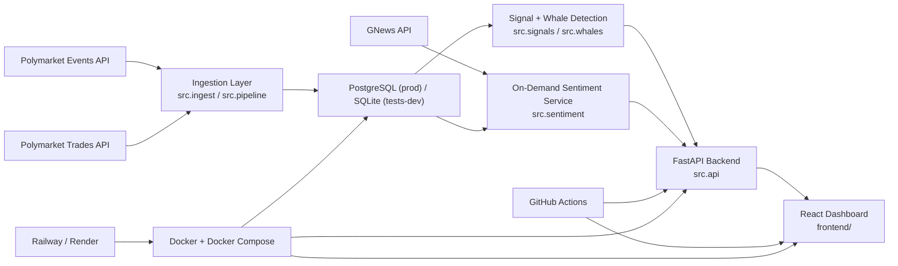

# Information Edge

Information Edge is a full-stack prediction market intelligence dashboard that correlates price movement, sentiment, and anomalous trading activity.

## Demo

Add screenshots or a short demo GIF here.

- `docs/screenshot-dashboard.png`
- `docs/demo-correlation.gif`

## Core Question

Do sentiment shifts and large-trader activity lead, lag, or coincide with prediction market price movement?

## Key Features

- Market browser with search, category filters, signal filters, and clear selected-market state
- Historical price tracking from stored market snapshots
- Rule-based anomaly detection for price movement, volume spikes, and liquidity shifts
- Whale tracking from normalized Polymarket trade data
- On-demand, cached sentiment analysis using GNews headlines and HuggingFace sentiment inference
- Correlation view that aligns price, sentiment, anomaly events, and whale activity on one timeline
- FastAPI read API for markets, signals, whales, runs, and sentiment
- React dashboard built for interview demos and rapid operator-style scanning

## Architecture Overview

Information Edge is intentionally simple: fetch market data, persist it, generate explainable signals, enrich markets with lazy sentiment only when needed, and expose the result through a thin API and a focused dashboard.



## Tech Stack

- Backend: Python, FastAPI, SQLAlchemy, Alembic
- Frontend: React, TypeScript, Vite, Recharts
- Data + analytics: PostgreSQL in production, SQLite for lightweight dev/test cases, NumPy-style statistical logic implemented in Python services
- NLP: HuggingFace Transformers + Torch, GNews headline fetch
- Infra hardening: Docker, Docker Compose, GitHub Actions

## Repository Layout

```text
src/
  api.py
  api_client.py
  config.py
  db.py
  ingest.py
  pipeline.py
  queries.py
  sentiment.py
  signals.py
  whales.py
migrations/
tests/
frontend/
  src/
  package.json
docker-compose.yml
Dockerfile
frontend/Dockerfile
.github/workflows/
```

## Local Setup

### Backend

```powershell
python -m venv venv
.\venv\Scripts\Activate.ps1
pip install -r requirements.txt
Copy-Item .env.example .env
alembic upgrade head
uvicorn src.api:app --reload
```

Backend docs and health endpoints:

- [http://127.0.0.1:8000/docs](http://127.0.0.1:8000/docs)
- [http://127.0.0.1:8000/health](http://127.0.0.1:8000/health)

### Frontend

```powershell
cd frontend
npm install
Copy-Item .env.example .env
npm run dev
```

Vite usually serves the app at [http://127.0.0.1:5173](http://127.0.0.1:5173).

### One-Time or Continuous Ingestion

Run one ingestion cycle:

```powershell
python -m src.pipeline once
```

Run the lightweight scheduler:

```powershell
python -m src.pipeline serve
```

Backfill whale events from stored trades:

```powershell
python -m src.whales backfill
python -m src.whales backfill --market-id <MARKET_ID>
```

## Docker Setup

The repo now includes a full-stack local container workflow with Postgres, the FastAPI backend, and the built frontend.

Start the stack:

```powershell
docker compose up --build
```

Stop the stack:

```powershell
docker compose down
```

Stop and remove the Postgres volume too:

```powershell
docker compose down -v
```

Services:

- frontend: [http://localhost:5173](http://localhost:5173)
- backend: [http://localhost:8000](http://localhost:8000)
- postgres: `localhost:5432`

The backend container runs `alembic upgrade head` before starting the API so the schema stays aligned in local containerized demos.

## Environment Variables

Copy the examples first:

```powershell
Copy-Item .env.example .env
Copy-Item frontend\.env.example frontend\.env
```

Important backend variables:

- `DATABASE_URL`: required database connection string
- `API_CORS_ORIGINS`: allowed browser origins for the frontend
- `POLYMARKET_*`: source API settings for events and trades
- `PIPELINE_*`: scheduler and logging settings
- `SIGNAL_*`: anomaly detection thresholds
- `WHALE_*`: whale detector thresholds
- `GNEWS_API_KEY`: optional; enables on-demand sentiment fetching
- `SENTIMENT_*`: sentiment TTL, model, and fetch limits

Important frontend variable:

- `VITE_API_BASE_URL`: public URL of the FastAPI backend

If `GNEWS_API_KEY` is blank, the app still runs, but on-demand sentiment generation remains unavailable and the UI will show the configured-state messaging instead of crashing.

## API Surface

Key routes:

- `GET /health`
- `GET /markets`
- `GET /markets/{market_id}`
- `GET /markets/{market_id}/history`
- `GET /markets/{market_id}/signals`
- `GET /markets/{market_id}/sentiment`
- `GET /markets/{market_id}/sentiment/documents`
- `GET /signals`
- `GET /whales/recent`
- `GET /markets/{market_id}/whales`
- `GET /markets/{market_id}/whale-summary`
- `GET /runs`

## Running Tests

Backend:

```powershell
.\venv\Scripts\python.exe -m pytest
```

Frontend:

```powershell
cd frontend
npm run test
npm run build
```

## GitHub Actions

Two CI workflows are included:

- `backend.yml`: installs Python dependencies and runs the backend test suite
- `frontend.yml`: installs Node dependencies, runs frontend tests, and builds the Vite app

They run on pushes to `main` and on pull requests.

## Deployment Notes

### Railway

Recommended demo deployment path:

1. Create a Postgres database in Railway.
2. Deploy the backend as a Docker service using the root `Dockerfile`.
3. Set backend env vars:
   - `DATABASE_URL`
   - `API_CORS_ORIGINS`
   - optional `GNEWS_API_KEY`
4. Run migrations:
   - `alembic upgrade head`
5. Deploy the frontend as a separate Docker service using `frontend/Dockerfile`.
6. Set `VITE_API_BASE_URL` to the public backend URL during the frontend build.

### Render

Render is also viable with the same split:

- backend web service from the root Dockerfile
- frontend static/web service from `frontend/Dockerfile`
- managed Postgres wired through `DATABASE_URL`

## Interview Talking Points

- Full-stack scope: ingestion, storage, analytics, API, frontend, and deployment hardening all live in one repo
- Explainable analytics: anomaly and whale detectors use explicit thresholds and market-local baselines
- Responsible ML: sentiment is lazy, cached, and optional rather than bolted into the hot path
- Product framing: the correlation view turns separate data pipelines into a clear market-intelligence story

## Future Improvements

- Historical backtesting of signal and sentiment lead/lag behavior
- Alert delivery for new whale or anomaly events
- Trader concentration and wallet clustering
- Richer topic/entity extraction or RAG over stored headlines

## Current Status

The app is feature-complete through Phase 7 and hardened in Phase 8 for local startup, CI validation, containerized demos, and deployment readiness. The product logic from earlier phases remains unchanged; this phase focuses on reproducibility, documentation, and presentation quality.
