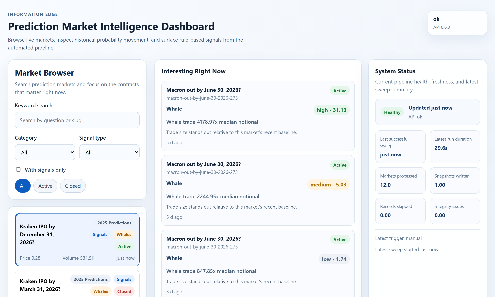
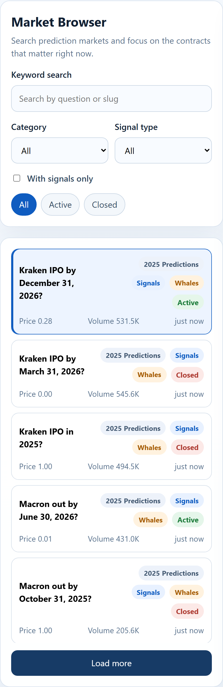
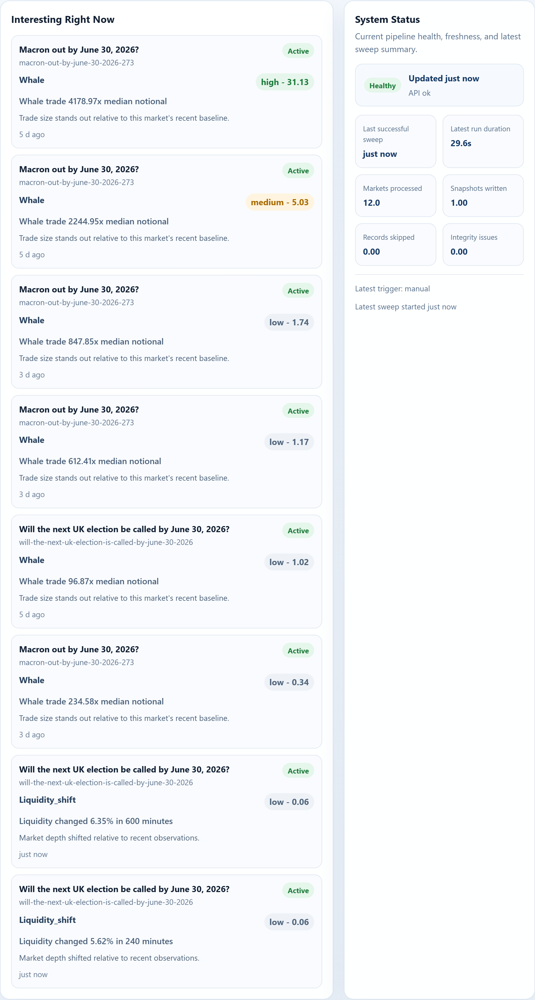
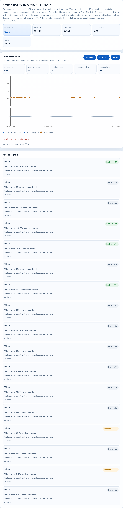
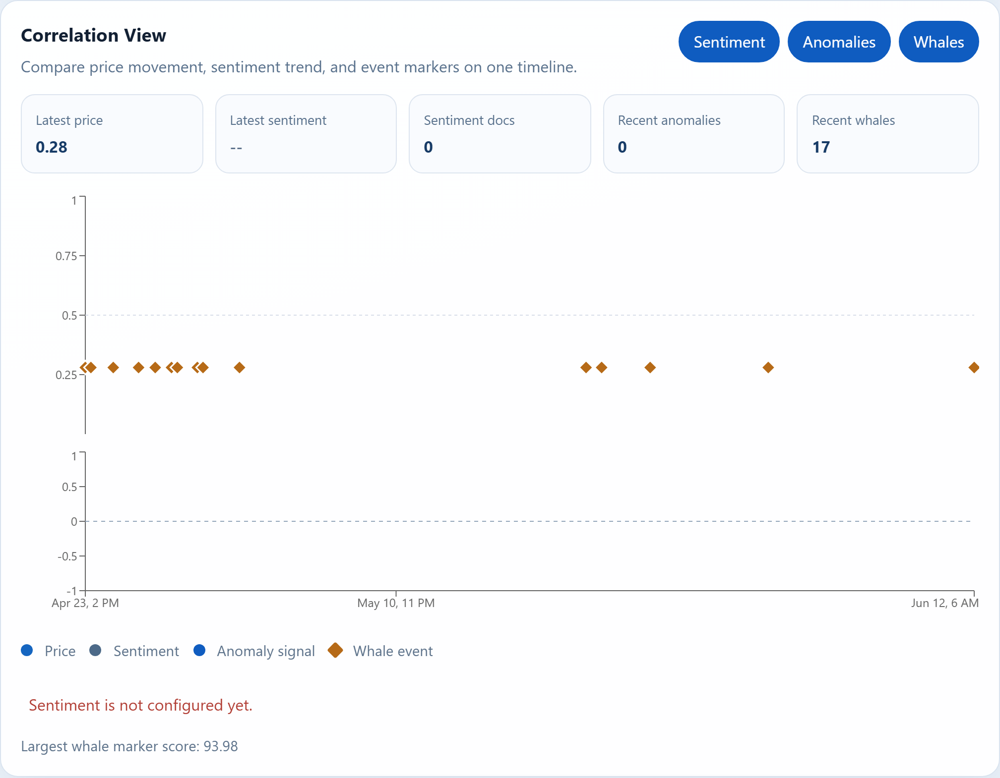
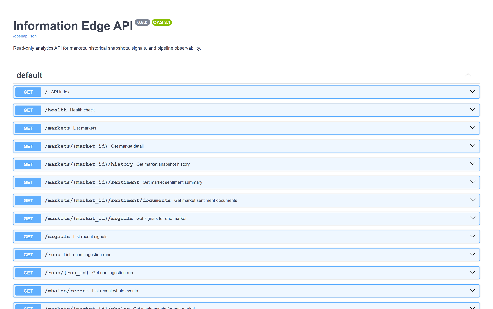
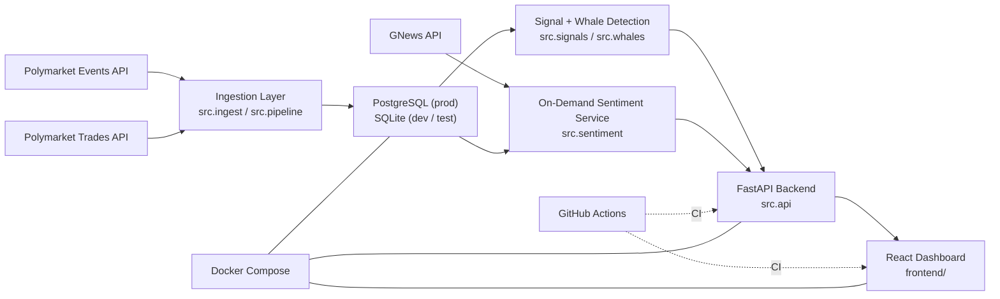

<div align="center">

# Information Edge

### Prediction Market Intelligence Dashboard

**Do sentiment shifts and large‑trader activity lead, lag, or coincide with prediction‑market price movement?**

Information Edge is a full‑stack analytics platform that ingests live [Polymarket](https://polymarket.com) data, detects anomalous price/volume/liquidity moves and whale‑sized trades, enriches markets with on‑demand news sentiment, and lines it all up on a single correlation timeline.

<br/>


</div>

<br/>



---

## Demo

A short walkthrough: selecting a market, scrolling to the correlation view, and toggling the sentiment / anomaly / whale layers on one shared timeline.


> The screenshots and GIF in this README are captured from a live local run against the real Polymarket API.

---

## Why it exists

Prediction markets price the probability of real‑world events. But a price by itself doesn't tell you *why* it moved. Information Edge brings three independent signals into one view so you can reason about cause and timing:

1. **Price** — historical probability movement from stored market snapshots.
2. **Flow** — whale‑sized trades, surfaced from normalized Polymarket trade data.
3. **Narrative** — news sentiment, computed on demand and cached per market.

The product framing is deliberately operator‑style: scan everything that's *interesting right now*, then drill into a single market and inspect its story end‑to‑end.

---

## Feature tour

### Market browser
Server‑backed search, category and signal‑type filters, an "active / closed" toggle, a "with signals only" switch, and at‑a‑glance badges for signals, whales, and status — so discovery stays fast without a second detail pane.



### Signal feed + system status
The "Interesting Right Now" feed ranks the strongest recent events across all markets (whale notional multiples, anomaly severity tiers). The System Status panel exposes pipeline health, freshness, and the latest ingestion sweep — observability is a first‑class surface, not an afterthought.



### Market detail
A focused drill‑down: latest price, volume, liquidity, and status up top, followed by the correlation view and the full per‑market signal history.



### Correlation view
The core surface. Price, sentiment trend, anomaly markers, and whale events share one synchronized timeline, with each layer independently toggleable. Whale markers reflect the market's *real* large‑trade history; the price and sentiment layers fill in as the pipeline accumulates snapshots and a news key is configured.



### Read API
A thin, self‑documenting FastAPI read layer (OpenAPI / Swagger UI at `/docs`).



<details>
<summary><b>Full dashboard view</b></summary>

<br/>


</details>

---

## Architecture

The design is intentionally simple: fetch market data, persist it, generate **explainable** signals, enrich markets with **lazy** sentiment only when needed, and expose the result through a thin API and a focused dashboard.


```mermaid
flowchart LR
    A["Polymarket Events API"] --> B["Ingestion Layer<br/>src.ingest / src.pipeline"]
    A2["Polymarket Trades API"] --> B
    N["GNews API"] --> S["On-Demand Sentiment Service<br/>src.sentiment"]
    B --> D["PostgreSQL (prod)<br/>SQLite (dev / test)"]
    D --> G["Signal + Whale Detection<br/>src.signals / src.whales"]
    D --> S
    G --> F["FastAPI Backend<br/>src.api"]
    S --> F
    F --> R["React Dashboard<br/>frontend/"]
    C["GitHub Actions"] -. CI .-> F
    C -. CI .-> R
    X["Docker Compose"] --- F
    X --- R
    X --- D
```

**Design principles**

- **Explainable analytics.** Anomaly and whale detectors use explicit thresholds and market‑local baselines — never opaque black boxes.
- **Responsible ML.** Sentiment is lazy, cached, and optional rather than bolted into the ingestion hot path.
- **Thin API.** The read layer converts stored models into frontend‑friendly responses without duplicating business logic.
- **Reproducible.** Containerized stack, CI on every push/PR, and a one‑command local boot.

---

## Tech stack

| Layer | Technologies |
| --- | --- |
| **Backend** | Python, FastAPI, SQLAlchemy, Alembic, APScheduler |
| **Frontend** | React, TypeScript, Vite, Recharts |
| **Data** | PostgreSQL (production), SQLite (dev/test), statistical logic in Python services |
| **NLP** | HuggingFace Transformers + Torch, GNews headline fetch |
| **Infra** | Docker, Docker Compose, GitHub Actions, Railway / Render |

---

## Quick start

### Option A — Docker (full stack)

Brings up Postgres, the FastAPI backend, and the built frontend together. The backend runs `alembic upgrade head` on boot so the schema stays aligned.

```powershell
docker compose up --build
```

| Service | URL |
| --- | --- |
| Frontend | http://localhost:5173 |
| Backend | http://localhost:8000 |
| API docs | http://localhost:8000/docs |
| Postgres | `localhost:5432` |

```powershell
docker compose down       # stop
docker compose down -v    # stop and drop the Postgres volume
```

### Option B — Run locally

<details>
<summary><b>Backend</b></summary>

```powershell
python -m venv venv
.\venv\Scripts\Activate.ps1
pip install -r requirements.txt
Copy-Item .env.example .env
alembic upgrade head
uvicorn src.api:app --reload
```

- API docs: http://127.0.0.1:8000/docs
- Health: http://127.0.0.1:8000/health

</details>

<details>
<summary><b>Frontend</b></summary>

```powershell
cd frontend
npm install
Copy-Item .env.example .env
npm run dev
```

Vite serves the app at http://127.0.0.1:5173.

</details>

<details>
<summary><b>Ingestion</b></summary>

```powershell
python -m src.pipeline once     # run one ingestion cycle
python -m src.pipeline serve    # run the lightweight scheduler

python -m src.whales backfill                       # backfill whales from stored trades
python -m src.whales backfill --market-id <ID>      # backfill a single market
```

> Tip: for a quick demo against a fresh database, point `DATABASE_URL` at SQLite
> (e.g. `sqlite+pysqlite:///./demo.db`) and run a few ingestion cycles to populate
> markets, trades, whales, and signals.

</details>

---

## Configuration

Copy the examples and adjust as needed:

```powershell
Copy-Item .env.example .env
Copy-Item frontend\.env.example frontend\.env
```

<details>
<summary><b>Environment variables</b></summary>

**Backend**

| Variable | Purpose |
| --- | --- |
| `DATABASE_URL` | Database connection string (Postgres in prod, SQLite for dev/test) |
| `API_CORS_ORIGINS` | Allowed browser origins for the frontend |
| `POLYMARKET_*` | Source API settings for events and trades |
| `PIPELINE_*` | Scheduler and logging settings |
| `SIGNAL_*` | Anomaly detection thresholds |
| `WHALE_*` | Whale detector thresholds |
| `GNEWS_API_KEY` | Optional; enables on‑demand sentiment fetching |
| `SENTIMENT_*` | Sentiment TTL, model, and fetch limits |

**Frontend**

| Variable | Purpose |
| --- | --- |
| `VITE_API_BASE_URL` | Public URL of the FastAPI backend |

</details>

If `GNEWS_API_KEY` is blank the app still runs end to end — on‑demand sentiment is simply
disabled, and the UI shows a clear "not configured" state instead of failing.

---

## API surface

A read‑only analytics API for markets, snapshots, signals, whales, and pipeline observability.

| Method | Route | Description |
| --- | --- | --- |
| `GET` | `/health` | Service health |
| `GET` | `/markets` | List / filter markets |
| `GET` | `/markets/{id}` | Market detail |
| `GET` | `/markets/{id}/history` | Price snapshot history |
| `GET` | `/markets/{id}/signals` | Signals for one market |
| `GET` | `/markets/{id}/sentiment` | Cached sentiment summary |
| `GET` | `/markets/{id}/sentiment/documents` | Scored headlines |
| `GET` | `/markets/{id}/whales` | Whale events for one market |
| `GET` | `/markets/{id}/whale-summary` | Whale summary for one market |
| `GET` | `/signals` | Recent signals across markets |
| `GET` | `/whales/recent` | Recent whale events |
| `GET` | `/runs` | Recent ingestion runs |

---

## Testing

```powershell
# Backend
.\venv\Scripts\python.exe -m pytest

# Frontend
cd frontend
npm run test
npm run build
```

CI runs both suites on every push to `main` and on pull requests:

- `backend.yml` — installs Python deps and runs the backend test suite
- `frontend.yml` — installs Node deps, runs frontend tests, and builds the Vite app

---

## Project structure

```text
src/
  api.py            # FastAPI read layer
  api_client.py     # Polymarket HTTP client
  ingest.py         # ingestion cycle
  pipeline.py       # CLI: one-shot + scheduler
  signals.py        # rule-based anomaly detection
  whales.py         # whale detection + backfill
  sentiment.py      # lazy, cached sentiment service
  models.py         # SQLAlchemy models
  queries.py        # read queries
migrations/         # Alembic migrations
tests/              # backend test suite
frontend/
  src/components/   # dashboard UI (browser, detail, correlation, panels)
  src/utils/        # correlation + formatting helpers
docs/media/         # screenshots and demo GIF
docker-compose.yml
Dockerfile
.github/workflows/  # CI
```

---

## Deployment

The split deploys cleanly to Railway or Render:

1. Provision managed **Postgres** and wire it through `DATABASE_URL`.
2. Deploy the **backend** as a Docker service from the root `Dockerfile`; set `API_CORS_ORIGINS` (and optionally `GNEWS_API_KEY`), then run `alembic upgrade head`.
3. Deploy the **frontend** as a separate Docker service from `frontend/Dockerfile`, building with `VITE_API_BASE_URL` pointed at the public backend URL.

---

## Roadmap

- Historical backtesting of signal and sentiment lead/lag behavior
- Alert delivery for new whale or anomaly events
- Trader concentration and wallet clustering
- Richer topic/entity extraction or RAG over stored headlines

---

<div align="center">
<sub>Built as a full‑stack portfolio project — ingestion, storage, analytics, API, frontend, and deployment hardening in one repo.</sub>
</div>
